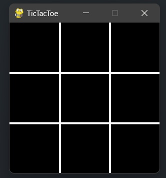
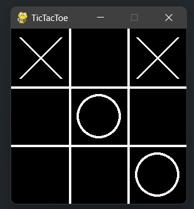
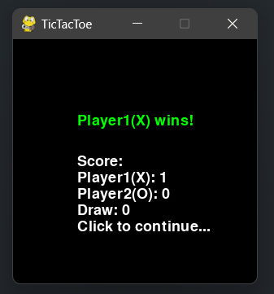

# tic-tac-toe-pygame
Utilising one of Python's library (Pygame) to create a simple tic-tac-toe game

<h2> How to run </h2>
<pre>
 git clone https://github.com/wjc1512/tic-tac-toe-pygame.git
 cd tic-tac-toe-pygame
 python main.py
</pre>

<h2> How it works </h2>

1) Player1(x) starts first, followed by Player2(O)
 

2) Each player makes decision on position to place symbol from available grid

3) Outcomes of each decision made by each player will be checked

4) Results will be displayed when either player wins or match ends with a draw

5) Players get to view match result and tracked score when results are displayed

6) Players can proceed onto the next match by clicking anywhere on the screen

<h2> Screenshots </h2>

  
  
  
 

